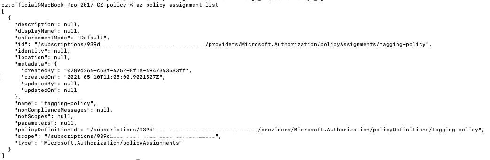
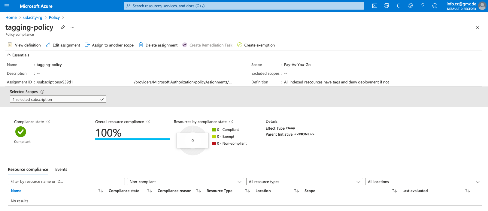
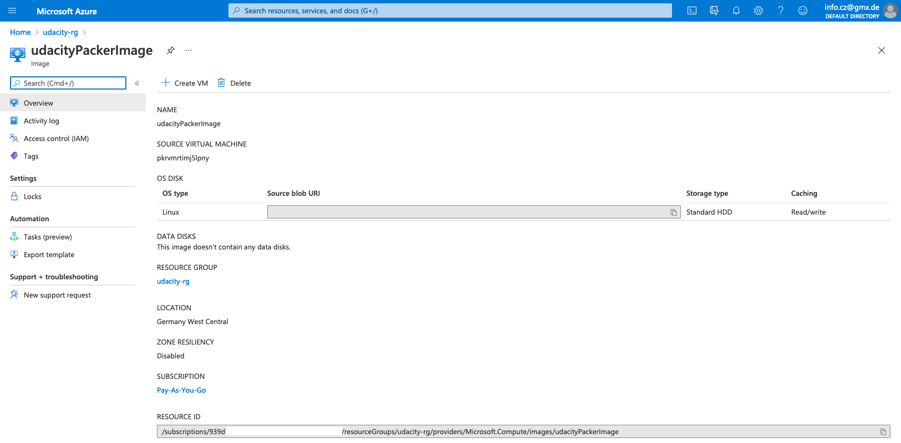
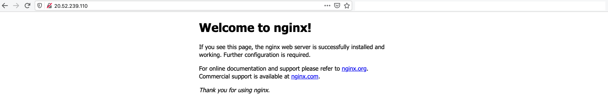
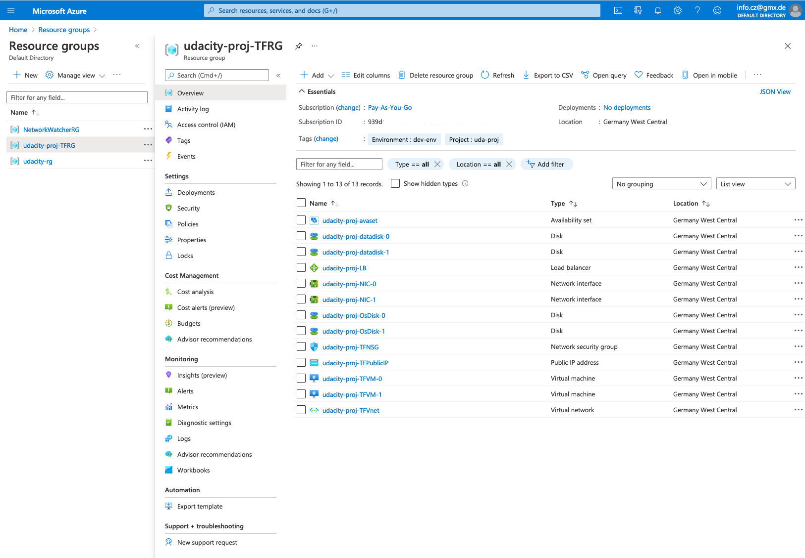

# Azure Infrastructure Operations Project: Deploying a scalable IaaS Web Server in Azure

* [Introduction](#introduction)
* [Instructions](#instructions)
* [Output](#output)

## Introduction
This project is part of the Udacity Azure ML Nanodegree.\
In order to deploy a customizable, scalable Web Server in Azure, Packer and Terraform is used. Instructions as well as the output is detailed below.

## Instructions
### Policy
Before getting started, I created a policy that ensures all indexed resources are tagged and deny deployment if they do not.

It was created in the terminal (first screenshot) but also visible in the Azure portal (second screenshot). The policy is written in a `policy.json` file.

- Terminal:


- Portal:


### Packer
As a second step, I used Packer to create a server image in order to support the application deployment later on with Terraform. 

Instructions:
1. Log in to Azure CLI: `az login`.
2. Create Azure resource group for the server image: `az group create`. Alternatively done in the Azure portal.
3. Create Azure credentials for service principal: `az ad sp create-for-rbac`.
4. Define `server.json` packer template: This template builds an Ubuntu 16.04 LTS image, installs NGINX, then deprovisions the VM.
5. Set variabales: Either use the command line, use a file or use environment variables. I used the latter and set my environment variables as temporarily by using the `export` command in the terminal.
6. Build packer image by running `packer build server.json` in the terminal.

````
=> Wait completed after 6 minutes 55 seconds

==> Builds finished. The artifacts of successful builds are:
--> azure-arm: Azure.ResourceManagement.VMImage:

OSType: Linux
ManagedImageResourceGroupName: udacity-rg
ManagedImageName: udacityPackerImage
ManagedImageId: /subscriptions/939dXXXX/resourceGroups/udacity-rg/providers/Microsoft.Compute/images/udacityPackerImage
ManagedImageLocation: germanywestcentral
````

- Portal:


### Terraform
As a final step, I used Terraform to deploy the Azure Web Server Infrastructure. The crucial part is to write the appropriate Packer and Terraform templates (`server.json` and `main.tf`), then, it is possible to use a service principle in Azure to deploy the Virtual Machine Image using Packer.

Instructions:
1. Execute `terraform init`.
2. Change the `variables.tf` file according to your needs. I pre-defined the `prefix`, `tags`, `number of VMs`, `username`, `password` and `location` as variables. The variables are used in the `main.tf` file.
3. Change the `main.tf` file according to your needs. Important note here: The image name of the packer file needs to be consitent in both files (`server.json` and `main.tf`). In my case, this is: `udacityPackerImage`.
4. Execute `terraform plan`.
5. Exectue `terraform apply`.
6. Open any browser and run the given load balancer public IP adress to get access to the Azure Web Server.
7. Execute `terraform destroy` to shut down the whole infrastructure.

This is the ouput when executing `terraform plan -out solution.plan`:

`````
Terraform will perform the following actions:

  # azurerm_availability_set.main will be created
  + resource "azurerm_availability_set" "main" {
      + id                           = (known after apply)
      + location                     = "germanywestcentral"
      + managed                      = true
      + name                         = "udacity-proj-avaset"
      + platform_fault_domain_count  = 2
      + platform_update_domain_count = 5
      + resource_group_name          = "udacity-proj-TFRG"
      + tags                         = {
          + "Environment" = "dev-env"
          + "Project"     = "uda-proj"
        }
    }

  # azurerm_lb.main will be created
  + resource "azurerm_lb" "main" {
      + id                   = (known after apply)
      + location             = "germanywestcentral"
      + name                 = "udacity-proj-LB"
      + private_ip_address   = (known after apply)
      + private_ip_addresses = (known after apply)
      + resource_group_name  = "udacity-proj-TFRG"
      + sku                  = "Basic"
      + tags                 = {
          + "Environment" = "dev-env"
          + "Project"     = "uda-proj"
        }

      + frontend_ip_configuration {
          + id                            = (known after apply)
          + inbound_nat_rules             = (known after apply)
          + load_balancer_rules           = (known after apply)
          + name                          = "PublicIPAddress"
          + outbound_rules                = (known after apply)
          + private_ip_address            = (known after apply)
          + private_ip_address_allocation = (known after apply)
          + private_ip_address_version    = "IPv4"
          + public_ip_address_id          = (known after apply)
          + public_ip_prefix_id           = (known after apply)
          + subnet_id                     = (known after apply)
        }
    }

  # azurerm_lb_backend_address_pool.main will be created
  + resource "azurerm_lb_backend_address_pool" "main" {
      + backend_ip_configurations = (known after apply)
      + id                        = (known after apply)
      + load_balancing_rules      = (known after apply)
      + loadbalancer_id           = (known after apply)
      + name                      = "udacity-proj-backendAddrPool"
      + outbound_rules            = (known after apply)
      + resource_group_name       = (known after apply)
    }

  # azurerm_lb_probe.main will be created
  + resource "azurerm_lb_probe" "main" {
      + id                  = (known after apply)
      + interval_in_seconds = 15
      + load_balancer_rules = (known after apply)
      + loadbalancer_id     = (known after apply)
      + name                = "http-probe"
      + number_of_probes    = 2
      + port                = 80
      + protocol            = (known after apply)
      + resource_group_name = "udacity-proj-TFRG"
    }

  # azurerm_lb_rule.main will be created
  + resource "azurerm_lb_rule" "main" {
      + backend_address_pool_id        = (known after apply)
      + backend_port                   = 80
      + disable_outbound_snat          = false
      + enable_floating_ip             = false
      + frontend_ip_configuration_id   = (known after apply)
      + frontend_ip_configuration_name = "PublicIPAddress"
      + frontend_port                  = 80
      + id                             = (known after apply)
      + idle_timeout_in_minutes        = (known after apply)
      + load_distribution              = (known after apply)
      + loadbalancer_id                = (known after apply)
      + name                           = "HTTP"
      + probe_id                       = (known after apply)
      + protocol                       = "Tcp"
      + resource_group_name            = "udacity-proj-TFRG"
    }

  # azurerm_managed_disk.main[0] will be created
  + resource "azurerm_managed_disk" "main" {
      + create_option        = "Empty"
      + disk_iops_read_write = (known after apply)
      + disk_mbps_read_write = (known after apply)
      + disk_size_gb         = 1
      + id                   = (known after apply)
      + location             = "germanywestcentral"
      + name                 = "udacity-proj-datadisk-0"
      + resource_group_name  = "udacity-proj-TFRG"
      + source_uri           = (known after apply)
      + storage_account_type = "Standard_LRS"
    }

  # azurerm_managed_disk.main[1] will be created
  + resource "azurerm_managed_disk" "main" {
      + create_option        = "Empty"
      + disk_iops_read_write = (known after apply)
      + disk_mbps_read_write = (known after apply)
      + disk_size_gb         = 1
      + id                   = (known after apply)
      + location             = "germanywestcentral"
      + name                 = "udacity-proj-datadisk-1"
      + resource_group_name  = "udacity-proj-TFRG"
      + source_uri           = (known after apply)
      + storage_account_type = "Standard_LRS"
    }

  # azurerm_network_interface.main[0] will be created
  + resource "azurerm_network_interface" "main" {
      + applied_dns_servers           = (known after apply)
      + dns_servers                   = (known after apply)
      + enable_accelerated_networking = false
      + enable_ip_forwarding          = false
      + id                            = (known after apply)
      + internal_dns_name_label       = (known after apply)
      + internal_domain_name_suffix   = (known after apply)
      + location                      = "germanywestcentral"
      + mac_address                   = (known after apply)
      + name                          = "udacity-proj-NIC-0"
      + private_ip_address            = (known after apply)
      + private_ip_addresses          = (known after apply)
      + resource_group_name           = "udacity-proj-TFRG"
      + tags                          = {
          + "Environment" = "dev-env"
          + "Project"     = "uda-proj"
        }
      + virtual_machine_id            = (known after apply)

      + ip_configuration {
          + name                          = "internal"
          + primary                       = true
          + private_ip_address            = (known after apply)
          + private_ip_address_allocation = "dynamic"
          + private_ip_address_version    = "IPv4"
          + subnet_id                     = (known after apply)
        }
    }

  # azurerm_network_interface.main[1] will be created
  + resource "azurerm_network_interface" "main" {
      + applied_dns_servers           = (known after apply)
      + dns_servers                   = (known after apply)
      + enable_accelerated_networking = false
      + enable_ip_forwarding          = false
      + id                            = (known after apply)
      + internal_dns_name_label       = (known after apply)
      + internal_domain_name_suffix   = (known after apply)
      + location                      = "germanywestcentral"
      + mac_address                   = (known after apply)
      + name                          = "udacity-proj-NIC-1"
      + private_ip_address            = (known after apply)
      + private_ip_addresses          = (known after apply)
      + resource_group_name           = "udacity-proj-TFRG"
      + tags                          = {
          + "Environment" = "dev-env"
          + "Project"     = "uda-proj"
        }
      + virtual_machine_id            = (known after apply)

      + ip_configuration {
          + name                          = "internal"
          + primary                       = true
          + private_ip_address            = (known after apply)
          + private_ip_address_allocation = "dynamic"
          + private_ip_address_version    = "IPv4"
          + subnet_id                     = (known after apply)
        }
    }

  # azurerm_network_interface_backend_address_pool_association.main[0] will be created
  + resource "azurerm_network_interface_backend_address_pool_association" "main" {
      + backend_address_pool_id = (known after apply)
      + id                      = (known after apply)
      + ip_configuration_name   = "internal"
      + network_interface_id    = (known after apply)
    }

  # azurerm_network_interface_backend_address_pool_association.main[1] will be created
  + resource "azurerm_network_interface_backend_address_pool_association" "main" {
      + backend_address_pool_id = (known after apply)
      + id                      = (known after apply)
      + ip_configuration_name   = "internal"
      + network_interface_id    = (known after apply)
    }

  # azurerm_network_security_group.main will be created
  + resource "azurerm_network_security_group" "main" {
      + id                  = (known after apply)
      + location            = "germanywestcentral"
      + name                = "udacity-proj-TFNSG"
      + resource_group_name = "udacity-proj-TFRG"
      + security_rule       = (known after apply)
      + tags                = {
          + "Environment" = "dev-env"
          + "Project"     = "uda-proj"
        }
    }

  # azurerm_network_security_rule.ruleAllowHTTPVnetInboundFromInternet will be created
  + resource "azurerm_network_security_rule" "ruleAllowHTTPVnetInboundFromInternet" {
      + access                      = "Allow"
      + destination_address_prefix  = "*"
      + destination_port_range      = "80"
      + direction                   = "Inbound"
      + id                          = (known after apply)
      + name                        = "AllowHTTPVnetInboundFromInternet"
      + network_security_group_name = "udacity-proj-TFNSG"
      + priority                    = 1001
      + protocol                    = "Tcp"
      + resource_group_name         = "udacity-proj-TFRG"
      + source_address_prefix       = "*"
      + source_port_range           = "*"
    }

  # azurerm_network_security_rule.ruleDenyAllVnetInboundFromInternet will be created
  + resource "azurerm_network_security_rule" "ruleDenyAllVnetInboundFromInternet" {
      + access                      = "Deny"
      + destination_address_prefix  = "*"
      + destination_port_range      = "*"
      + direction                   = "Inbound"
      + id                          = (known after apply)
      + name                        = "DenyAllVnetInboundFromInternet"
      + network_security_group_name = "udacity-proj-TFNSG"
      + priority                    = 1002
      + protocol                    = "*"
      + resource_group_name         = "udacity-proj-TFRG"
      + source_address_prefix       = "*"
      + source_port_range           = "*"
    }

  # azurerm_public_ip.main will be created
  + resource "azurerm_public_ip" "main" {
      + allocation_method       = "Static"
      + fqdn                    = (known after apply)
      + id                      = (known after apply)
      + idle_timeout_in_minutes = 4
      + ip_address              = (known after apply)
      + ip_version              = "IPv4"
      + location                = "germanywestcentral"
      + name                    = "udacity-proj-TFPublicIP"
      + resource_group_name     = "udacity-proj-TFRG"
      + sku                     = "Basic"
      + tags                    = {
          + "Environment" = "dev-env"
          + "Project"     = "uda-proj"
        }
    }

  # azurerm_resource_group.main will be created
  + resource "azurerm_resource_group" "main" {
      + id       = (known after apply)
      + location = "germanywestcentral"
      + name     = "udacity-proj-TFRG"
      + tags     = {
          + "Environment" = "dev-env"
          + "Project"     = "uda-proj"
        }
    }

  # azurerm_subnet.main will be created
  + resource "azurerm_subnet" "main" {
      + address_prefix                                 = (known after apply)
      + address_prefixes                               = [
          + "10.0.1.0/24",
        ]
      + enforce_private_link_endpoint_network_policies = false
      + enforce_private_link_service_network_policies  = false
      + id                                             = (known after apply)
      + name                                           = "udacity-proj-TFSubnet"
      + resource_group_name                            = "udacity-proj-TFRG"
      + virtual_network_name                           = "udacity-proj-TFVnet"
    }

  # azurerm_subnet_network_security_group_association.main will be created
  + resource "azurerm_subnet_network_security_group_association" "main" {
      + id                        = (known after apply)
      + network_security_group_id = (known after apply)
      + subnet_id                 = (known after apply)
    }

  # azurerm_virtual_machine.main[0] will be created
  + resource "azurerm_virtual_machine" "main" {
      + availability_set_id              = (known after apply)
      + delete_data_disks_on_termination = false
      + delete_os_disk_on_termination    = false
      + id                               = (known after apply)
      + license_type                     = (known after apply)
      + location                         = "germanywestcentral"
      + name                             = "udacity-proj-TFVM-0"
      + network_interface_ids            = (known after apply)
      + resource_group_name              = "udacity-proj-TFRG"
      + tags                             = {
          + "Environment" = "dev-env"
          + "Project"     = "uda-proj"
        }
      + vm_size                          = "Standard_DS1_v2"

      + identity {
          + identity_ids = (known after apply)
          + principal_id = (known after apply)
          + type         = (known after apply)
        }

      + os_profile {
          + admin_password = (sensitive value)
          + admin_username = "czofficial"
          + computer_name  = "udacity-proj-TFVM"
          + custom_data    = (known after apply)
        }

      + os_profile_linux_config {
          + disable_password_authentication = false
        }

      + storage_data_disk {
          + caching                   = (known after apply)
          + create_option             = (known after apply)
          + disk_size_gb              = (known after apply)
          + lun                       = (known after apply)
          + managed_disk_id           = (known after apply)
          + managed_disk_type         = (known after apply)
          + name                      = (known after apply)
          + vhd_uri                   = (known after apply)
          + write_accelerator_enabled = (known after apply)
        }

      + storage_image_reference {
          + id      = "/subscriptions/939d1c66-7864-4f15-8560-5c793c4110c8/resourceGroups/udacity-rg/providers/Microsoft.Compute/images/udacityPackerImage"
          + version = (known after apply)
        }

      + storage_os_disk {
          + caching                   = "ReadWrite"
          + create_option             = "FromImage"
          + disk_size_gb              = (known after apply)
          + managed_disk_id           = (known after apply)
          + managed_disk_type         = "Premium_LRS"
          + name                      = "udacity-proj-OsDisk-0"
          + os_type                   = (known after apply)
          + write_accelerator_enabled = false
        }
    }

  # azurerm_virtual_machine.main[1] will be created
  + resource "azurerm_virtual_machine" "main" {
      + availability_set_id              = (known after apply)
      + delete_data_disks_on_termination = false
      + delete_os_disk_on_termination    = false
      + id                               = (known after apply)
      + license_type                     = (known after apply)
      + location                         = "germanywestcentral"
      + name                             = "udacity-proj-TFVM-1"
      + network_interface_ids            = (known after apply)
      + resource_group_name              = "udacity-proj-TFRG"
      + tags                             = {
          + "Environment" = "dev-env"
          + "Project"     = "uda-proj"
        }
      + vm_size                          = "Standard_DS1_v2"

      + identity {
          + identity_ids = (known after apply)
          + principal_id = (known after apply)
          + type         = (known after apply)
        }

      + os_profile {
          + admin_password = (sensitive value)
          + admin_username = "czofficial"
          + computer_name  = "udacity-proj-TFVM"
          + custom_data    = (known after apply)
        }

      + os_profile_linux_config {
          + disable_password_authentication = false
        }

      + storage_data_disk {
          + caching                   = (known after apply)
          + create_option             = (known after apply)
          + disk_size_gb              = (known after apply)
          + lun                       = (known after apply)
          + managed_disk_id           = (known after apply)
          + managed_disk_type         = (known after apply)
          + name                      = (known after apply)
          + vhd_uri                   = (known after apply)
          + write_accelerator_enabled = (known after apply)
        }

      + storage_image_reference {
          + id      = "/subscriptions/939d1c66-7864-4f15-8560-5c793c4110c8/resourceGroups/udacity-rg/providers/Microsoft.Compute/images/udacityPackerImage"
          + version = (known after apply)
        }

      + storage_os_disk {
          + caching                   = "ReadWrite"
          + create_option             = "FromImage"
          + disk_size_gb              = (known after apply)
          + managed_disk_id           = (known after apply)
          + managed_disk_type         = "Premium_LRS"
          + name                      = "udacity-proj-OsDisk-1"
          + os_type                   = (known after apply)
          + write_accelerator_enabled = false
        }
    }

  # azurerm_virtual_machine_data_disk_attachment.main[0] will be created
  + resource "azurerm_virtual_machine_data_disk_attachment" "main" {
      + caching                   = "ReadWrite"
      + create_option             = "Attach"
      + id                        = (known after apply)
      + lun                       = 0
      + managed_disk_id           = (known after apply)
      + virtual_machine_id        = (known after apply)
      + write_accelerator_enabled = false
    }

  # azurerm_virtual_machine_data_disk_attachment.main[1] will be created
  + resource "azurerm_virtual_machine_data_disk_attachment" "main" {
      + caching                   = "ReadWrite"
      + create_option             = "Attach"
      + id                        = (known after apply)
      + lun                       = 10
      + managed_disk_id           = (known after apply)
      + virtual_machine_id        = (known after apply)
      + write_accelerator_enabled = false
    }

  # azurerm_virtual_network.main will be created
  + resource "azurerm_virtual_network" "main" {
      + address_space         = [
          + "10.0.0.0/16",
        ]
      + guid                  = (known after apply)
      + id                    = (known after apply)
      + location              = "germanywestcentral"
      + name                  = "udacity-proj-TFVnet"
      + resource_group_name   = "udacity-proj-TFRG"
      + subnet                = (known after apply)
      + tags                  = {
          + "Environment" = "dev-env"
          + "Project"     = "uda-proj"
        }
      + vm_protection_enabled = false
    }

Plan: 23 to add, 0 to change, 0 to destroy.

Changes to Outputs:
  + lb_url = (known after apply)
`````

## Output
When executing `terraform apply solution.plan`, the URL of the web server will be shown at the end of the whole creation process.
`````
Apply complete! Resources: 23 added, 0 changed, 0 destroyed.

Outputs:

lb_url = "http://20.52.239.110/"
`````

#### Azure Web Server
This is a screenshot of the deployed Web Server when calling the public IP of the load balancer:


#### Resource Group in Azure Portal
This is a screenshot of the created resource group with all deployed resources:


- Deletion of the whole Web Server Infrastructure:
This can be done by executing `terraform destroy` in the terminal.