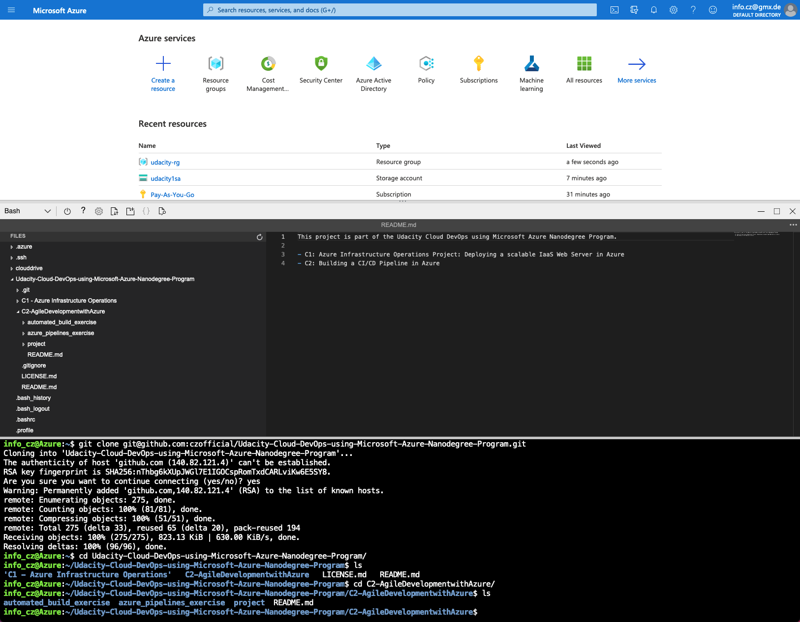
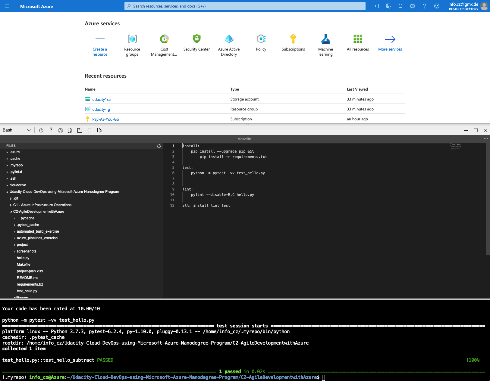
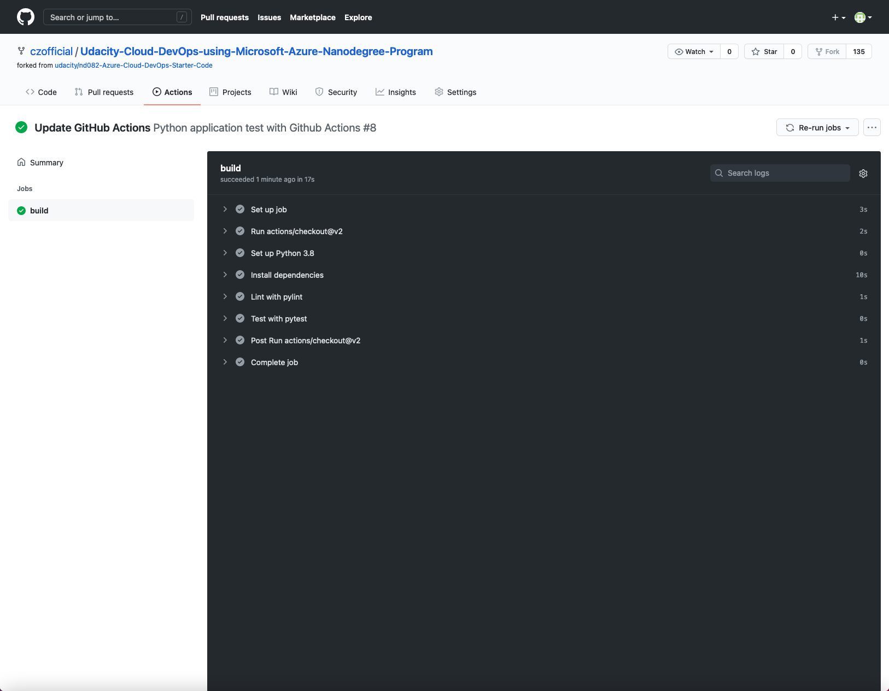

# Building a CI/CD Pipeline in Azure

* [Overview](#overview)
* [Project Plan](#project-plan)
* [Issues](#issues)
* [Continious Delivery](#continious-delivery)

## Overview
This project is part of the Udacity Cloud DevOps using Microsoft Azure Nanodegree Program.

In this project, I'll build a CI/CD pipeline in Azure, using a pre-trained machine learning model about house price predictions in Boston. The focus of this project is clearly on the build, test, deploy and operationalising part, rather than on the actual machine learning model. The link to the Kaggle dataset can be found [here](https://www.kaggle.com/c/boston-housing).

This project consists of 4 major steps:
1. Using GitHub as the tool for source control
2. Using GitHub Actions for the CI part
3. Using Azure Pipelines for the CD part
4. Using Azure App Service for the Python flask web app

To put it in a nutshell, a local push to the GitHub repo triggers automatically Github Actions for code testing, before triggering automatically Azure DevOps Pipelines for deploying the tested code to the Azure Web Service. Once, evertything is setup, the Python flask web app is designed to predict house prices in Boston.\
Obviously there is no need to use GitHub and GitHub Actions as you could also use Azure DevOps Repos for the CI part. 

Here is an architectural diagram:

## Project Plan
As it is critical to have an effective project plan and task tracking, I created a Trello board for task tracking as well as a spreadsheet with the estimated project plan. 

* A link to the Trello board for the project can be found [here](https://trello.com/b/fkjm3q3o/building-a-ci-cd-pipeline-in-azure).
* A link to the spreadsheet that includes the original and final project plan can be found [here](./project-plan.xlsx).
* A link to the screencast can be found [here](link).

## Issues
As I wasn't aware of the fact that GitHub Actions works best when all the necessary code is in the root directory of the repo, I came across of some difficulties since this repo consists of two independent projects. As a solution, I integrated the initial CI part of this project in this repo, and the actual machine learning CI/CD pipeline in a completely independent one. This is the reason, why I also have duplicate files in the root and C2 folder.

## Continious Delivery
### Setup of Azure Cloud Shell
- Create GitHub repo (in my case: use this already exisiting one)
- Launch Azure Cloud Shell environment, create ssh keys and upload keys to the GitHub account.
- Clone GitHub project into Azure Cloud Shell environment.

Screenshot:

- Create Makefile
- Create requirements.txt
- Create Python Virtual Environment
- Create script file and test file (hello.py and test_hello.py)
- Test CI part locally

Screenshot:

### Configure GitHub Actions
- Enable GitHub Actions
- Replace YML code with provided scaffolding code
- Verify remote tests pass

Screenshot:
